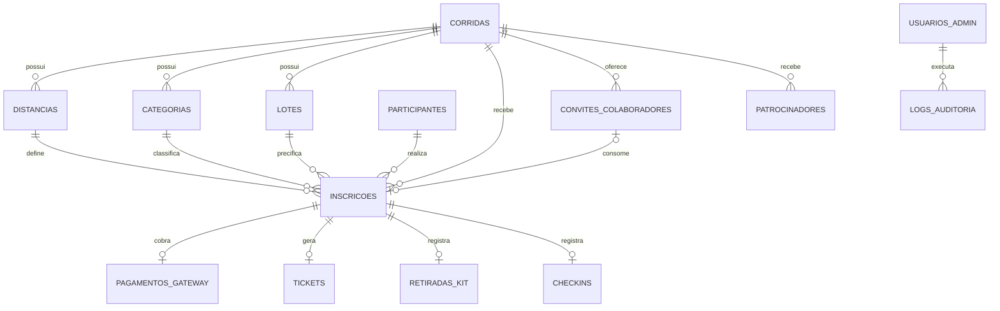

# Banco de dados

## Modelo lógico

O diagrama expressa relacionamentos lógicos. No SQL atual, quase todos são mantidos pela aplicação e por índices; somente `patrocinadores.corrida_id` e `patrocinadores.analisado_por` possuem `FOREIGN KEY` explícita.

## Dicionário das tabelas

| Tabela | Responsabilidade | Regras e índices relevantes |
|---|---|---|
| `corridas` | Evento, publicação, datas e textos legais | `slug` único; registro padrão `4-corrida-mpl` |
| `distancias` | Distâncias vinculadas à corrida | índice por corrida; fluxo público seleciona 5 km no backend |
| `categorias` | Compatibilidade de categoria, gênero e idade | índices por corrida e distância |
| `lotes` | Preço, período, capacidade e vendidos | pode ser geral ou vinculado à categoria |
| `participantes` | Dados pessoais do atleta | CPF único; armazena consentimento LGPD |
| `enderecos` | Estrutura legada de endereço | não é usada pela inscrição pública atual |
| `contatos_emergencia` | Contato opcional do participante | vínculo lógico com participante |
| `inscricoes` | Registro central do participante no evento | número único; status, tipo e valor definidos no servidor |
| `pagamentos` | Estrutura histórica de pagamento | não representa o Checkout Pagar.me atual |
| `pagamentos_gateway` | Estado do Payment Link e confirmação | uma linha por inscrição; link único; tentativas de e-mail |
| `tickets` | Token e conteúdo do QR | uma linha por inscrição; token único |
| `retiradas_kit` | Retirada física | uma linha por inscrição, operador e horário |
| `checkins` | Entrada no evento | uma linha por inscrição e índice por corrida |
| `usuarios_admin` | Identidade e perfil administrativo | e-mail único, senha bcrypt e flag ativo |
| `logs_auditoria` | Trilha administrativa e operacional | usuário opcional, ação, alvo, descrição e IP |
| `participante_codigos_acesso` | Código temporário enviado por e-mail | hash SHA-256, validade, tentativas e consumo |
| `participante_sessoes` | Sessão sem senha do participante | token armazenado somente como hash e revogação |
| `limites_requisicao` | Rate limiting persistente | chave pseudonimizada e janela de bloqueio |
| `convites_colaboradores` | Convite gratuito, cancelamento e consumo | token único, uso único e vínculo final à inscrição |
| `patrocinadores` | Propostas e publicação de parceiros | status editorial, logo e duas FKs explícitas |

## Estados principais

`inscricoes.status` usa principalmente `pendente_pagamento`, `paga`, `confirmada` e `cancelada`. Inscrições públicas pagas ficam `paga`; colaborador isento é confirmado sem gateway. `inscricoes.tipo` diferencia `publico` e `colaborador_mpl`.

`pagamentos_gateway.status` é limitado a `PROCESSING`, `PAID`, `FAILED`, `EXPIRED`, `CANCELLED` ou `REFUNDED`. O status da Pagar.me também fica preservado em `status_gateway`.

O convite é derivado das datas: cancelado quando `cancelado_em` existe; utilizado quando `utilizado_em` existe; expirado quando `expira_em` passou; disponível nos demais casos.

## Integridade e transações

- CPF, número de inscrição, token do ingresso, link de pagamento e token do convite têm unicidade no banco.
- Retirada e check-in possuem unicidade por inscrição, impedindo duplicidade mesmo com requisições concorrentes.
- Convite gratuito é validado e consumido no backend; valor e tipo enviados pelo navegador não são confiáveis.
- A confirmação de pagamento compara referência, identificador do pedido e valor em centavos antes de alterar a inscrição.
- Operações com múltiplas gravações devem permanecer dentro das transações já existentes; falha intermediária precisa provocar rollback.

## Dados pessoais e retenção

CPF, nome, nascimento, gênero, e-mail, telefone, contato de emergência e logs de IP são dados pessoais. A organização deve definir formalmente base legal, prazo de retenção, anonimização e atendimento de direitos. Backups e exports administrativos precisam receber a mesma proteção do banco principal.

## Migrações e compatibilidade

O arquivo `database/mariadb.sql` é a referência consolidada de uma instalação nova. `api/database/schema.php` ainda executa `CREATE TABLE IF NOT EXISTS` e ajustes incrementais para instalações antigas, incluindo campos de e-mail no gateway, `inscricoes.tipo`, `tickets.qr_code_data` e valores de isenção. Não edite produção manualmente sem registrar a alteração e testar restore.

## Backup e restauração

Backup lógico deve incluir schema, dados, procedures se houver, charset e timezone. Faça cópia separada de `assets/images/sponsors` e dos segredos, protegida por controle de acesso. A validade do backup só é comprovada por restauração periódica em ambiente isolado e pelos testes de contagem, login, inscrição, ticket e auditoria.
