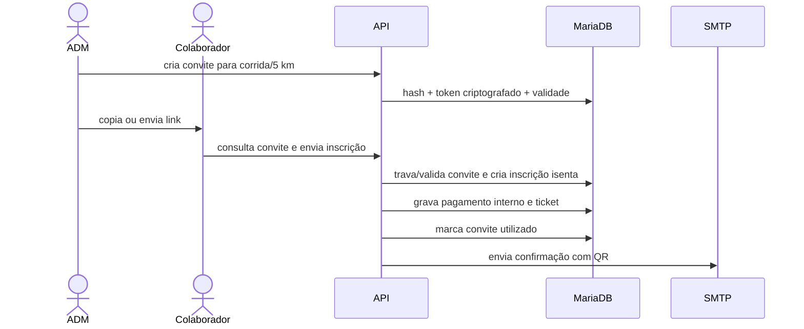

# Fluxos de negócio e integrações

## Inscrição pública e pagamento

```mermaid
sequenceDiagram
    actor P as Participante
    participant F as Frontend
    participant A as API MPL
    participant D as MariaDB
    participant G as Pagar.me
    participant M as SMTP
    P->>F: informa dados e aceita termos
    F->>A: create-registration
    A->>D: valida evento, 5 km, lote e CPF
    A->>D: grava participante e inscrição pendente
    F->>A: create-checkout
    A->>G: cria Payment Link PIX/cartão
    G-->>F: URL do checkout hospedado
    G->>A: webhook
    A->>G: relê pedido pela API
    A->>D: confere referência e valor; marca pago
    A->>D: gera ticket único
    A->>M: envia confirmação e QR Code
```

O servidor seleciona a categoria ativa associada à distância de 5 km e o lote vigente. Se o CPF já existe, o e-mail precisa coincidir; é proibida uma segunda inscrição do mesmo CPF na corrida. A capacidade do lote é atualizada de forma condicional para evitar venda além do limite.

O Checkout é hospedado pela Pagar.me/Stone. A aplicação não recebe número, CVV ou validade do cartão. Os métodos permitidos no link são PIX e cartão de crédito. Um link válido e ainda não expirado é reutilizado; a chave de idempotência reduz duplicidade externa.

## Confirmação de pagamento

O webhook é um gatilho, não fonte de verdade. Ao recebê-lo, o backend extrai o identificador do pedido e consulta `/orders/{id}` autenticado na Pagar.me. Só confirma quando:

- o pedido é conhecido pela referência ou `order_id`;
- o identificador tem o formato esperado;
- o código do pedido coincide com a referência interna;
- o estado confirmado é pago/capturado;
- o valor pago em centavos é exatamente o valor da inscrição.

A consulta manual `pagarme-payment-status` aplica a mesma rotina. Após confirmação, o ticket é criado de forma idempotente e o e-mail é reivindicado por atualização atômica com intervalo mínimo de cinco minutos.

## E-mail transacional

`mail_service.php` implementa SMTP com `AUTH LOGIN`, TLS oportunista ou SSL direto, validação de certificado e dot-stuffing. Também existe fallback explícito para `mail()`. As mensagens incluem acesso, inscrição, convite e ingresso com QR Code.

Falha de transporte não desfaz pagamento. O registro mantém número de tentativas e último erro. `mail-worker`, protegido por segredo, busca até 20 pagamentos confirmados sem e-mail e limita cada registro a 10 tentativas. A operação deve ser agendada externamente pelo servidor.

## Convite de colaborador MPL



O token possui 32 bytes aleatórios representados em hexadecimal. O banco guarda hash para busca e versão AES-256-CBC para que o administrador possa reenviar o link. O convite pode ser cancelado, expira pelo prazo configurado e só pode ser consumido uma vez. O backend força tipo `colaborador_mpl`, valor zero e isenção; a Pagar.me não é chamada.

## Acesso do participante

1. O usuário informa o e-mail.
2. A API aplica limites por IP e e-mail e responde de forma que não revele se há cadastro.
3. Um código de seis dígitos é enviado e armazenado como hash, com validade curta e limite de tentativas.
4. Código válido é consumido e cria token de sessão de 12 horas.
5. Consultas e reenvios somente alcançam inscrições do e-mail da sessão.

## Ticket, retirada e check-in

O ticket é único por inscrição e contém token aleatório persistido. O QR codifica esse token, não dados pessoais. `validate-ticket` mostra a situação operacional. Retirada e check-in exigem inscrição paga/confirmada/isenta e perfil de operação. Índices únicos tornam as duas operações idempotentes e impedem repetição concorrente.

## Patrocínio

O formulário público valida empresa, responsável, contato, CNPJ opcional, URL e mensagem. A proposta entra como pendente. Admin/super_admin pode revisar, aprovar, publicar e enviar logo. A área pública retorna apenas registros aprovados e publicados.

## Dependências externas

| Serviço | Direção | Falha esperada |
|---|---|---|
| Pagar.me Core v5 | saída HTTPS e webhook de entrada | inscrição continua pendente; API retorna erro controlado |
| SMTP | saída TCP/TLS | pagamento persiste; e-mail fica pendente para reenvio |
| Câmera do navegador | local | operador pode digitar/buscar token conforme interface disponível |

Não há integração ativa com Belluno. Os endpoints históricos existem apenas para retornar remoção explícita.
